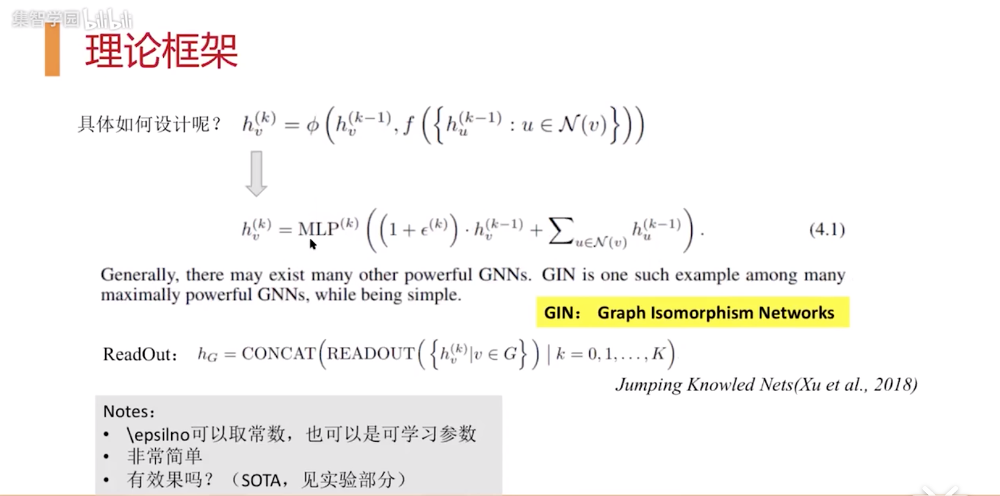
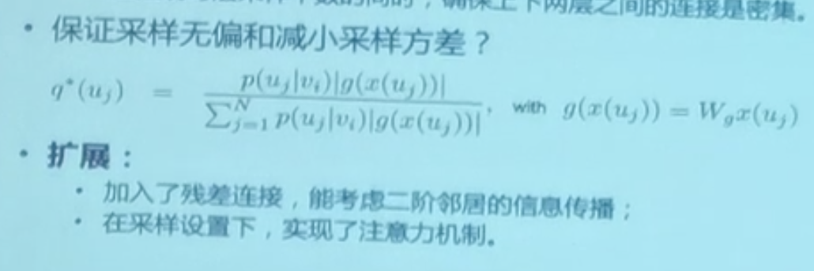
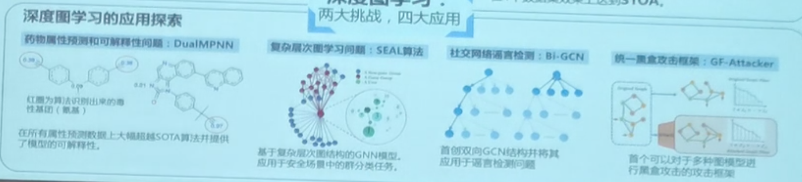

# 图神经网络101
重新捡一捡GNN相关研究成果。
## Warmup
- [How powerful are GNNs](https://www.bilibili.com/video/av58456459)
  - 贡献
    - 对GNN对图结构的表征能力进行了分析
    - 提出了GIN框架，在图分类任务上达到SOTA
    - 因为不考虑出了结构信息外的其他feature，对一般的节点分类任务帮助不大
  - 
- [腾讯AI Lab的GNN分享](https://www.bilibili.com/video/av83519765)
  - 两种视角
    - 基于图结构的表示学习 Graph Embedding
      目标：保留拓扑信息
      定义“邻近”，求解“邻近”
      - DeepWalk(定义临近)
        - 1,2 hop -> LINE
        - Random Walk
      - Node2Vec
        - 人工设计概率跳转，模拟BFS、DFS特征
      - Struc2Vec
        - 保留局部结构一致性，构建新图
      - Metapath2Vec
        - 导演-电影-主演-奖项
    - 基于图特征的表示学习 GNN
      关注利用拓扑特征生成新的节点特征
      - GCN（对邻居节点特征带权重的聚合）
      - GraphSAGE（改变聚合方法，采样邻居节点）
      - GAT（对权重进行扩展）
  - 深度图学习面临的挑战
    - 如何做大
      - FastGCN
        - 把图节点特征当作由一个隐含概率分布产生，利用该分布对每一层的节点进行整体采样
      - ASGCN
        - FASGTGCN在节点多采样率小的情况下，层间链接会变少。ASGCN采用Layer dependent采样，确保上下两层之间的连接是密集
        - 
    - 如何做深
      - 过拟合、过平滑
      - DropEdge
  - Tencent的一些应用
    
    - SEAL：层次图（QQ群，学术论文）

