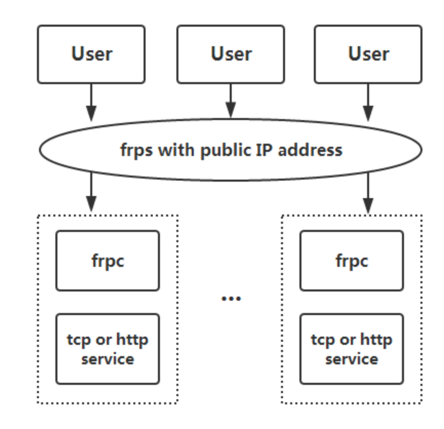

# 内网穿透的几种姿势
随着返校时间的一再推迟，入校vpn成了信科科研狗们毕业的一大希望。然鹅！用户量的激增导致了vpn的速度每况愈下，近几天更是每隔一段时间就要输入密码保持一下session。那就总结一下，近几天看了却一直没用的内网穿透方案吧。
## 应用场景
Given:	PC<----->VPS<-----Server
Realize:	PC----->Server
（果然一个网络系统的最大安全隐患永远是人）
**本文中以HostB代替VPS，HostC代替学校内网服务器，HostA代表自己的电脑**
## 方案一 SSH 反向代理
在HostC上运行，让HostC把22端口通过反向代理暴露给HostB的2222端口：
```sh
ssh -R 0.0.0.0:2222:0.0.0.0:22  user@HostB
```
同时设置HostB的*/etc/ssh/sshd_config*，添加```GatewayPorts yes```，允许远程主机连接本地的转发端口。
此时，访问VPS暴露的2222端口，就等于访问HostC的22端口。
```sh
 ssh -p 2222 user@HostB
```
可以通过修改sshd_config，加入以下代码防止ssh长时间没有操作自动断开
```sh
ClientAliveInterval 30 # 每30s发送一次，然后客户端响应，这样就保持长连接了
ClientAliveCountMax 5 # 最大没有响应的次数
```
然鹅这样仍然无法解决ssh因为**其他**原因的断开，这时候需要额外写脚本来检测重启，或者用 autossh 保活。(并且测试中还出现了卡死的情况？？？)
**因此，推荐的solution如下**
```sh
# 使用autossh的solution
ssh-copy-id user@host # 拷贝公钥
# autossh 跟ssh参数基本一致
# 其中 -C 为压缩数据，-q 安静模式，-T 禁止远程分配终端，-n 关闭标准输入，-N 不执行远程命令。
# -f 表示在后台运行
# -M 5678 : 负责通过5678端口监视连接状态，连接有问题时就会自动重连
autossh -M 5678 -CqTnNf -R 0.0.0.0:2222:0.0.0.0:22 user@HostB
# 或者可以简略一些
autossh -M 5678 -CqTnNf -R 2222:0.0.0.0:22 user@HostB
```
# 方案二 socat端口转发
```sh
# vps 只有在tcp 2222端口有请求时才会生成侦听tcp 5678端口
socat -d -d -d tcp-l:22,reuseaddr,bind=0.0.0.0,fork \
	tcp-l:5678,bind=0.0.0.0,reuseaddr,retry=10
# 内网服务器 将lan内的电脑不断尝试连接vps的tcp 5678端口，当连接成功后台会连到localhost提供的tcp 22端口应用
socat -d -d -d -v tcp:vpsip:5678,forever,intervall=10,fork tcp:localhost:80
```
因为暂时采用了方案一，本方案并没有实际测试。[socat](https://linux.die.net/man/1/socat)这鬼东西的参数还是奇奇怪怪的：
- -d的个数代表不同的log等级，比如- d -d -d代表输出fatal, error, warning, notice, and info messages.（前2个level默认都输出）
- -v 把转发的data也写入stderr中去
- tcp-l:22和tcp:vpsip:8080分别是listen和send TCP请求
- tcp/tcp-l的参数：
  - reuseaddr: Allows other sockets to bind to an address
  - forever,intervall=10: 每隔10s连接一次，无限循环
  - fork：建立连接后，创建子进程处理信道，母进程功能不变
# 方案三：frp
[frp](https://github.com/fatedier/frp)是一个用go实现的可用于内网穿透的高性能的反向代理应用，并且**尝试性支持了点对点穿透**。
由于VPS的带宽只有1M，在传输大文件时常见的端口转发手段显得力不从心。这里也总结一下配置以备不时之需。（*目前处于开发的初级阶段，并不能穿透所有类型的 NAT 设备，所以穿透成功率较低。穿透失败时可以尝试 **stcp** 的方式*）

Frp 结构很简单，分为 frps/frpc 两个可执行程序，frps运行在有公有IP的vps上，可执行程序可在[这里](https://github.com/fatedier/frp/releases)下载。针对本文的应用场景，可以使用如下的配置文件。
- VPS端
  ```python
  # frps.ini
  [common]
  bind_addr = 0.0.0.0
  bind_port = 6000
  bind_udp_port = 6001 # 额外配置一个 udp 端口用于支持点对点穿透的客户端
  token = ****	# 用于验证身份
  ```
- 内网服务器
  ```python
  # frps.ini
  [common]
  server_addr = vps ip
  server_port = 6000
  token = ****
  
  [service name]
  type = xtcp
  sk = ****	# 用于点对点验证身份
  local_ip = 127.0.0.1
  local_port = 22
  ```
- 需要穿透访问内网的电脑
  ```python
  # frps.ini
  [common]
  server_addr = vps ip
  server_port = 6000
  token = ****
  
  [service name]
  type = xtcp
  role = visitor
  server_name = service name
  sk = ****	# 用于点对点验证身份
  local_ip = 127.0.0.1
  local_port = 22 # 暴露的本地端口
  ```
  

